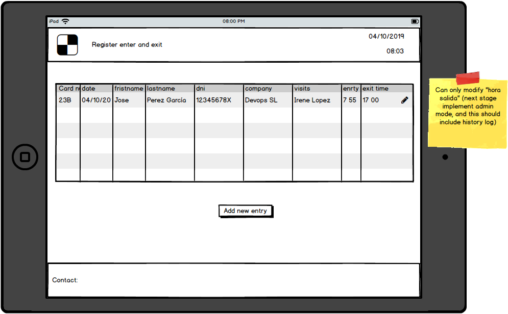
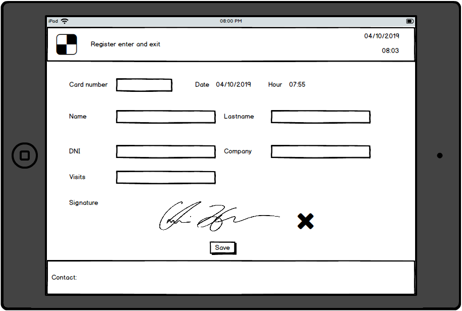
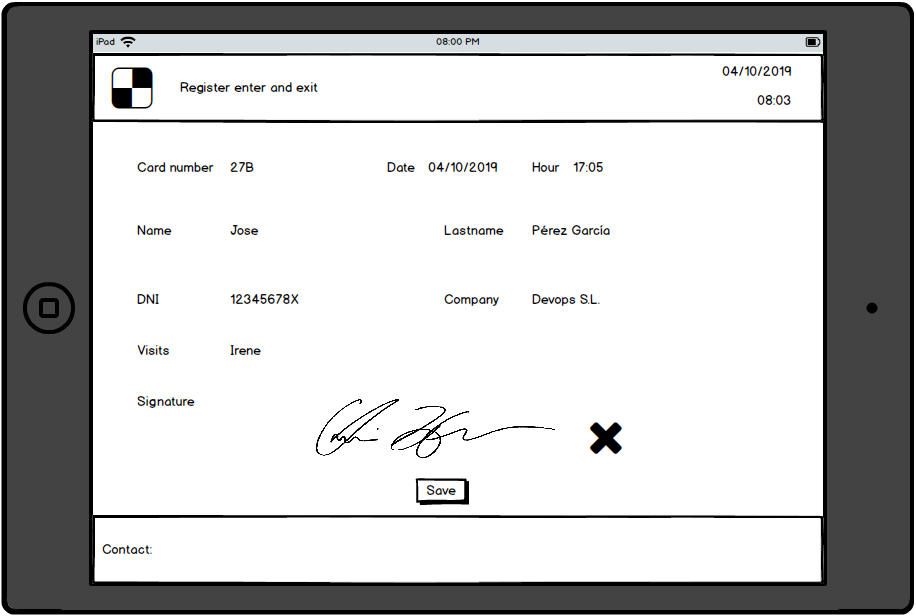

# Intro

Something

In this excercise we will implement a simple entry / exit register application.

# Functional

Implement a daily entry/exit register application:

- Target will be table.
- It will display a list of entries.
- A given user can add a new entry.
- A given user can register his exit time.
- It should support pad signature.

# Cases to be assigned

List of cases to be assigned:

- [1] Create a simple backend (we will make use of JSON server).

  - Create an API entry that will provide today's list of entries.
  - Create an API entry that will read an specific entry data.
  - Create an API entry that will allow to insert a new entry.
  - Create an API entry that will allow to update an exit.

- [2] Create a POC (in local project or codesandbox) to work with `react-signature-canvas`

  - I want to sign
  - I want to save a signature
  - I want to retrieve a saved signature

- [3] Layout

  - Build the application layout (header / footer).

- [4]  Build the list of entries Pods, UI (use viewmodel + mockdata)

- [5]  Build the add new entry Pods, UI (use viewmodel + mockdata)

- [6]  Build the update exit on existing entry Pods, UI (use viewmodel + mockdata)

- [7] Real front APIs

- [8] React promise tracker

- [9] Responsive layout

[Bonus]:

- Login

- Admin view.

# About Basefactor + Lemoncode

We are an innovating team of Front End Developers, passionate about turning your ideas into robust products.

[Basefactor, consultancy by Lemoncode](http://www.basefactor.com) provides consultancy and coaching services.

[Lemoncode](http://lemoncode.net/services/en/#en-home) provides training services.

For the LATAM/Spanish audience we are running an Online Front End Master degree, more info: http://lemoncode.net/master-frontend

